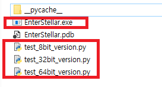
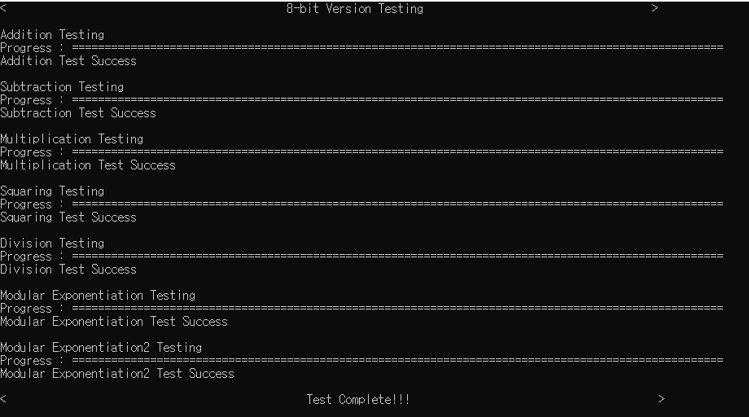
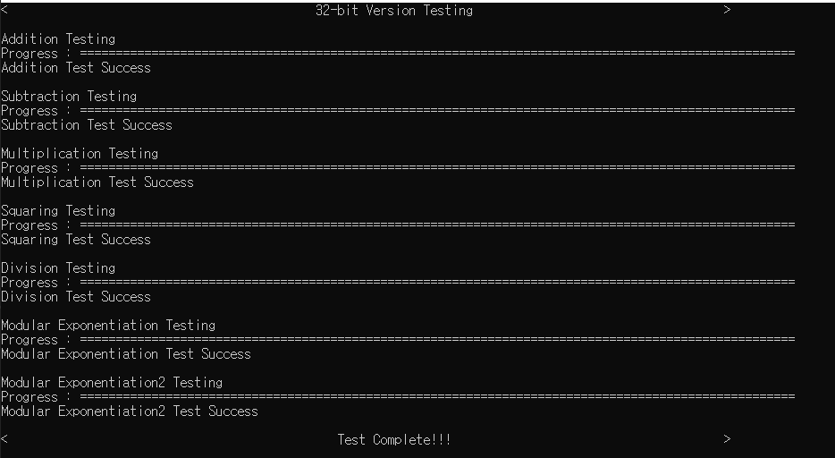
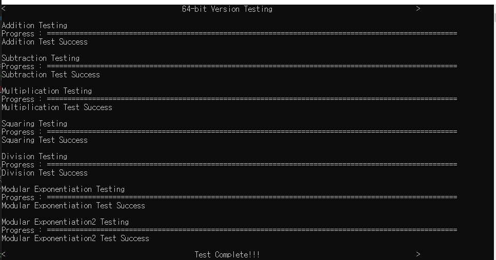
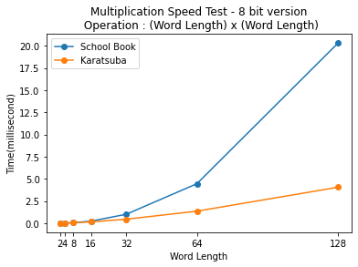
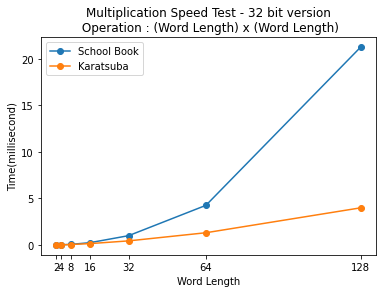

### 2021 Advanced Application Programming, by Department of Information, Security, Math and Cryptography   
***
### Introduction      
Team Name : Free'C'ize     
Project Name : Enter Stellar     
Team member : **👑Keon-hee Choi**, Yong-jin Lee, Hyeon-ho Lee    
Team intern : Yoon-seo Ki, Dong-chan Kim(not profeesor)   

Free'C'ize's Big Number C Library is a project for Crypto System such as RSA, DSA.     
Thank you :)     
***

# Enterstellar Operation test   
Enterstellar Operation test with python embedding 

## How to use

### Setting up Visual Studio

1. Change your Solution Platform to x64 
2. Project properties → vc++ directories
3. Add python include folder path in include directories
4. Add python libs folder path in library directories

### Add Python File

python file must be in the same location as the exe file

<Debug mode>

location : C:/EnterStellar/x64/Debug

<Release mode>

location : C:/EnterStellar/x64/Release



## Testing

```c
int main()
{
		srand((unsigned int)time(NULL));
    printf("<                                           %d-bit Version Testing                                   >\n\n", WordBitLen);
    ADD_test();
    SUB_test();
    MUL_test();
    SQU_test();
    DIV_test();
    ModularExponentiation1_test();
    ModularExponentiation2_test();
    printf("<                                              Test Complete!!!                                      >\n");
    return 0;
}
```

---

## Test Result





   
	
---  

## Enterstellar library Speed
Multiplication : Karatsuba vs SchoolBook




    
